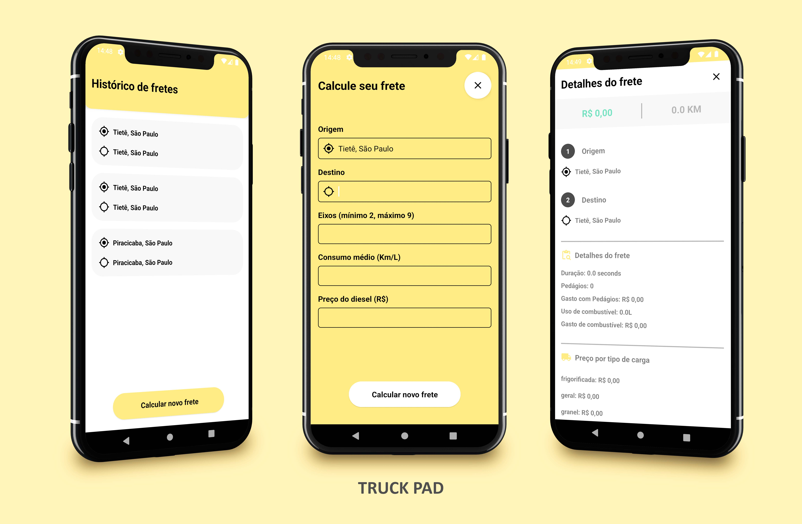

# TruckPad

<p align="center">
  <a href="#-tecnologias">Tecnologias</a>&nbsp;&nbsp;&nbsp;|&nbsp;&nbsp;&nbsp;
  <a href="#-projeto">Projeto</a>&nbsp;&nbsp;&nbsp;|&nbsp;&nbsp;&nbsp;
  <a href="#-configuração-no-emulador">Configuração no Emulador</a>&nbsp;&nbsp;&nbsp;|&nbsp;&nbsp;&nbsp;
  <a href="#-download">Download</a>&nbsp;&nbsp;&nbsp;|&nbsp;&nbsp;&nbsp;
</p>

<br>

## 🚀 Tecnologias

Neste projeto utilizei as seguintes tecnologias:

- Kotlin
- ROOM
- LiveData
- Retrofit
- Arquitetura MVVM

## 📱 Projeto

Neste projeto utilizei a arquitetura MVVM e as principais libs modernas do JetPack, 
como o Room, Retrofit e LiveData, buscando a separação de responsabilidades em camadas
na aplicação.

Na parte de layout, me inspirei no app já existente da TruckPad, trazendo sua paleta de cores.



## ⚙ Configuração no Emulador

Para obter uma melhor experiência, recomendo testar o app em um celular físico, baixando o APK
disponível nesse repositório. Isso pois o emulador pode apresentar alguma demora nos serviços de
localização ao abrir o formulário de cálculo de frete.

Para utilizar o emulador certifique-se de configurá-lo para utilizar os serviços de localização do Android.

Também é necessário atribuir a credencial de acesso a API do Google.

No arquivo local.properties, adicione:

```
API_KEY=<KEY>
MAPS_API_KEY=<KEY>
```

## 📲 Download

<a href="https://github.com/thiaagodev/TruckPad-Test/releases/download/APK/TruckPad.apk"> 
    Download APK
</a>

---

Desenvolvido por Thiago Ferreira :wave: